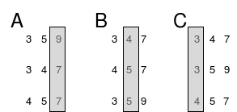

Radix sorting enters us into a new frontier of sorting that we haven't talked about: non-comparison based sorting. Up to this point _all_ of the sorts we've talked about in both courses have been comparison based sorts. That is to say, we decide the order of the numbers based on asking the question is this element bigger than that one over-and-over again until numbers are in order and the rest of the algorithm is just optimizing how often we ask that question. The big O of these comparison based algorithms cannot be any faster `n log n` so in order to get beyond that, we have to change what we're doing. We have to sort based on other criteria.

Enter non-comparison based algorithms. There are a few variations but we're going to focus on radix sort as it's one of the more useful algorithms. The basic idea is we're to enqueue each number in different queues based on what the last digit in the digit of the number (the "ones" place.) Once we do that, we'll dequeue each queue in order back into the original array. If you think about it, it'll everything will be sorted _up to the the ones place_. So your array will look like `[10, 1, 52, 102, 33, 45, 6, 18, 9]` or something like that. Notice all the ones places are in ascending order; just nothing else is. After we've done this, we'll repeate the process again but with the tens place. With the former example, it'd look like `[1, 102, 6, 9, 10, 18, 33, 45, 52]`. Lastly we'll do the process on the hundreds place (which in this example is just going to be the 0 bucket and the 1 bucket) and end up with `[1, 6, 9, 10, 18, 33, 45, 52, 102]`. That's it! It's sorted.

Courtesy of [Wikimedia](https://commons.wikimedia.org/wiki/File:Dsa_radix_sort.png)

That's the whole algorithm. Most variations of radix sort have micro optimizations that speed up the algorithm but the overall theme is what you've seen here. Often you'll see radix is done using a binary number system instead of a decimal one (like we've done) but this is best for simplicity. So there you go! Go give it a shot.

* [Exercise][exercise]
* [Completed][completed]

[exercise]: https://codepen.io/btholt/pen/eVWyPd?editors=0010
[completed]: https://codepen.io/btholt/pen/VQbMGJ?editors=0010
